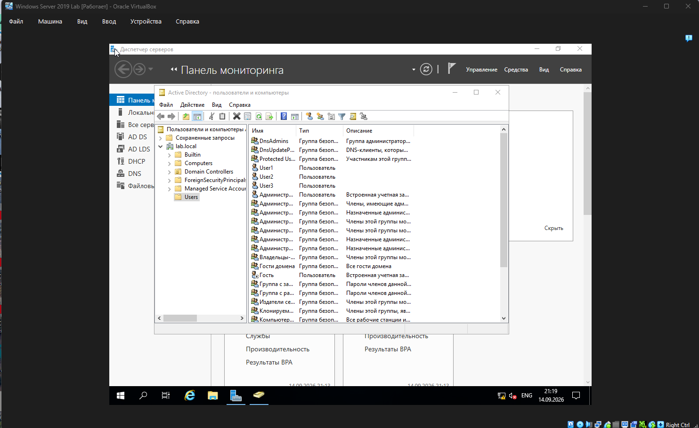

# 02. Active Directory (AD DS)

## 🎯 Что делаем на этом этапе

\- Устанавливаем роль **AD DS** (Active Directory Domain Services).

\- Создаём новый лес `lab.local` — контроллер домена.

\- Создаём OU (подразделение) `LabUsers`.

\- Создаём пользователей `user1`–`user4` с полными именами.

\- Настраиваем параметры паролей.

## 🧰 Что понадобится

\- Windows Server 2019 с настроенным статическим IP (см. этап 01).

\- Server Manager.

\- Учётная запись администратора.

## 📝 Шаги

### 1. Установка роли AD DS

1\. Открыть **Server Manager** → **Управление** → **Добавить роли и компоненты**.

2\. Тип установки: **Установка ролей или компонентов**.

3\. Целевой сервер: локальный.

4\. Роли: поставить галочку **Active Directory Domain Services**.

5\. Согласиться с добавлением компонентов.

6\. Дождаться установки.

### 2. Создание нового леса lab.local

1\. В Server Manager появится уведомление о пост-развёртывании — нажать **«Повысить уровень этого сервера до контроллера домена»**.

2\. Выбрать **«Добавить новый лес»**, корневое имя домена: `lab.local`.

3\. Уровень функциональности: Windows Server 2016 (по умолчанию).

4\. Пароль DSRM — задать и запомнить.

5\. Согласиться с предупреждением о DNS-делегировании (DNS не создавать — не требуется).

6\. Проверить параметры и нажать **Установить**.

7\. Сервер перезагрузится автоматически.

### 3. Создание OU LabUsers

1\. Открыть **Средства** → **Active Directory — пользователи и компьютеры**.

2\. Правой кнопкой по `lab.local` → **Создать** → **Подразделение**.

3\. Имя: `LabUsers`. ОК.

### 4. Создание пользователей

1\. Правой кнопкой по `LabUsers` → **Создать** → **Пользователь**.

2\. Заполнить:

&#x20;  - Имя, Фамилия, Полное имя — например, «Иван Иванов».

&#x20;  - **Имя входа пользователя**: `user1`, справа выбрать `@lab.local`.

3\. Задать пароль.

4\. Снять галочку **«Требовать смену пароля при следующем входе»**.

5\. Поставить галочку **«Срок действия пароля не ограничен»**.

6\. ОК. Повторить для `user2`, `user3`, `user4`.

> 💡 **Важно:** полное имя (Full name) — это отображаемое имя, оно не используется для входа. Для входа используется «Имя входа пользователя» — у нас `user1`–`user4`.

## 🧪 Проверка

1\. В оснастке открой `LabUsers` — все четыре пользователя на месте.

2\. Проверь логины: свойства `user1` → вкладка «Учётная запись» → имя входа `user1`.

Ожидаемый результат: лес `lab.local` создан, OU `LabUsers` существует, четыре активных пользователя.

## ⚠️ Проблемы и решения (из личного опыта)

\- **Ошибка «Install-ADDSForest не распознано»** — при попытке создать лес через PowerShell. Причина: модуль AD DS не был загружен в текущую сессию.

&#x20; - **Решение:** установить роль с ключом `-IncludeManagementTools` через `Install-WindowsFeature -Name AD-Domain-Services -IncludeManagementTools`, затем перезапустить PowerShell. После этого команда `Install-ADDSForest` доступна. Либо пойти через мастер в Server Manager.

\- **Пользователь создаётся, но по имени входа не логинится** — проверь поле **«Имя входа пользователя (пред-Windows 2000)»**. Оно должно быть коротким: `user1`, без пробелов и кириллицы.

\- **Пароль истекает через 42 дня** — для лабораторного стенда неудобно. Снять галочку «Требовать смену пароля при следующем входе» и поставить «Срок действия пароля не ограничен».

## 📸 Скриншот

