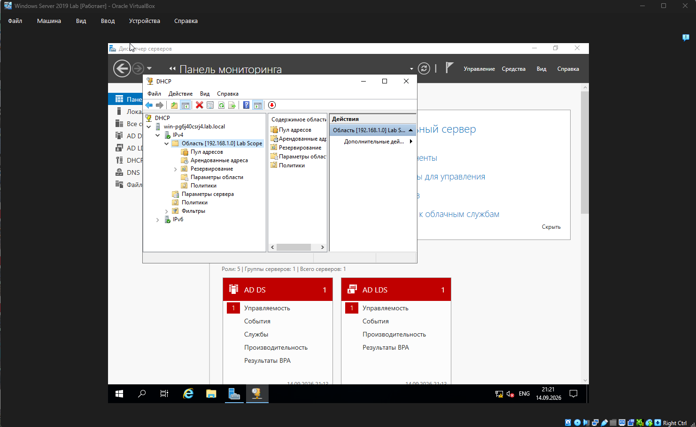

\# 03. DHCP


\## 🎯 Что делаем на этом этапе


\- Устанавливаем роль \*\*DHCP Server\*\*.

\- Авторизуем DHCP-сервер в Active Directory.

\- Создаём область (Scope) `Lab Scope` с диапазоном `192.168.1.100–200`.

\- Настраиваем параметры области (Scope Options): шлюз, DNS, DNS-суффикс.

\- Проверяем, что клиент получает адрес автоматически.


\## 🧰 Что понадобится


\- Windows Server 2019 с ролью AD DS (см. этап 02).

\- Статический IP на сервере `192.168.1.10`.

\- Server Manager.

\- Учётная запись администратора домена.


\## 📝 Шаги


\### 1. Установка роли DHCP


1\. \*\*Server Manager\*\* → \*\*Управление\*\* → \*\*Добавить роли и компоненты\*\*.

2\. Тип установки: \*\*Установка ролей или компонентов\*\*.

3\. Целевой сервер: локальный.

4\. Роли: поставить галочку \*\*DHCP Server\*\*.

5\. Согласиться с добавлением компонентов.

6\. Дождаться установки, завершить мастер.


\### 2. Авторизация DHCP в Active Directory


После установки роли в оснастке DHCP сервер будет в состоянии «не авторизован» — DHCP не имеет права выдавать адреса в домене, пока его не авторизуют.


1\. \*\*Server Manager\*\* → \*\*Средства\*\* → \*\*DHCP\*\*.

2\. В дереве: `dhcp.lab.local` → \*\*IPv4\*\*.

3\. Правой кнопкой по серверу → \*\*Авторизовать\*\* (Authorize).

4\. Обновить оснастку — статус должен стать «Активен».


\### 3. Создание области (Scope)


1\. В дереве: `IPv4` → правой кнопкой → \*\*Создать область\*\*.

2\. Мастер:

&#x20;  - \*\*Имя области:\*\* `Lab Scope`.

&#x20;  - \*\*Диапазон:\*\* с `192.168.1.100` по `192.168.1.200`.

&#x20;  - \*\*Маска:\*\* `255.255.255.0` (/24).

&#x20;  - \*\*Исключения:\*\* не нужны.

&#x20;  - \*\*Длительность аренды:\*\* оставить по умолчанию (8 дней).

3\. На шаге «Настройка параметров DHCP» выбрать \*\*«Да, настроить эти параметры сейчас»\*\*:

&#x20;  - \*\*Router (шлюз):\*\* `192.168.1.1`.

&#x20;  - \*\*DNS-сервер:\*\* `192.168.1.10`.

&#x20;  - \*\*DNS-суффикс:\*\* `lab.local`.

4\. Активировать область (по умолчанию — да).


\### 4. Проверка параметров области


1\. В дереве: `IPv4` → \*\*Scope `Lab Scope`\*\* → \*\*Scope Options\*\*.

2\. Убедиться, что присутствуют:

&#x20;  - `003 Router` → `192.168.1.1`

&#x20;  - `006 DNS Servers` → `192.168.1.10`

&#x20;  - `015 DNS Domain Name` → `lab.local`


\## 🧪 Проверка


На клиентской машине Windows 10:


```cmd

ipconfig


Ожидаемый результат:


IPv4-адрес из диапазона 192.168.1.100–200


Маска 255.255.255.0


Основной шлюз 192.168.1.1


DNS-суффикс lab.local


Если адрес вида 169.254.x.x (APIPA) — DHCP не выдал адрес, см. раздел ниже.


## ⚠️ Проблемы и решения (из личного опыта)

Клиент получает адрес 169.254.x.x (APIPA) — DHCP не отвечает.


Причина 1: клиент и сервер в разных сетях VirtualBox. Проверить тип сети: должен быть Internal Network с одинаковым именем (labnet) у обеих ВМ.


Причина 2: DHCP-сервер не авторизован в AD. Проверить в оснастке статус сервера — должен быть «Активен».


Причина 3: область не активирована. Проверить статус Scope — должен быть «Активен».


Клиент получает адрес, но нет доступа в сеть — проверить Scope Options: должны быть заданы Router (003) и DNS (006).


