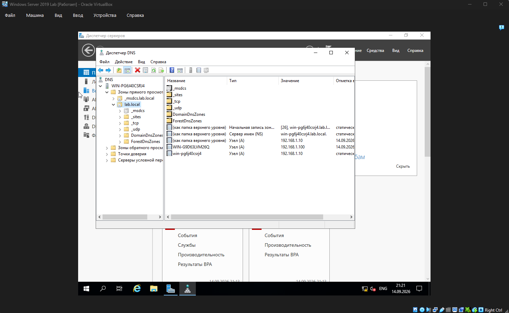

# 04. DNS


## 🎯 Что делаем на этом этапе


- Убеждаемся, что роль **DNS Server** установлена на контроллере домена.

- Проверяем зоны прямого просмотра, созданные автоматически при развёртывании AD DS.

- Проверяем разрешение имён с клиентской машины через `nslookup`.


## 🧰 Что понадобится


- Windows Server 2019 с ролью AD DS (см. этап 02).

- Клиентская машина Windows 10, подключённая к домену.

- Оснастка DNS.


## 📝 Шаги


### 1. DNS устанавливается автоматически вместе с AD DS


При создании нового леса `lab.local` (см. этап 02) Windows Server **автоматически**:

- устанавливает роль **DNS Server**;

- создаёт зону прямого просмотра `lab.local`;

- создаёт служебную зону `_msdcs.lab.local` (для служб Active Directory);

- добавляет A-запись контроллера домена (`WIN-SKIC7TCTV5T.lab.local` → `192.168.1.10`);

- прописывает DNS-сервер на самого себя (`127.0.0.1`).


Дополнительная ручная настройка **не требуется**.


### 2. Просмотр зон в оснастке DNS


1. **Server Manager** → **Средства** → **DNS**.

2. В дереве: `DNS` → `WIN-SKIC7TCTV5T` → **Зоны прямого просмотра**.

3. Здесь должны присутствовать:

&#x20;  - `lab.local` — основная зона домена;

&#x20;  - `_msdcs.lab.local` — служебная зона для AD DS;

&#x20;  - `TrustAnchors` — точки доверия (стандартная, не относится к лаборатории).

4. **Зоны обратного просмотра** — пустые (не создавались).


### 3. Проверка разрешения имён с клиента


На клиентской машине Windows 10:


```cmd

nslookup lab.local

nslookup WIN-SKIC7TCTV5T
```

Ожидаемый результат: оба имени разрешаются в 192.168.1.10.


## 🧪 Проверка

```
Что проверяем               Команда                       Ожидаемый результат
--------------------------  ----------------------------  ----------------------
Разрешение домена           nslookup lab.local            Address: 192.168.1.10
Разрешение имени сервера    nslookup WIN-SKIC7TCTV5T      Address: 192.168.1.10
```

## ⚠️ Проблемы и решения (из личного опыта)

DNS request timed out. timeout was 2 seconds перед каждым ответом nslookup — это не ошибка. nslookup сначала пытается выполнить обратный запрос (IP → имя DNS-сервера), но зона обратного просмотра не создана, поэтому попытка истекает по таймауту. После этого nslookup всё равно успешно выполняет прямой запрос. Если хочется убрать сообщение — нужно создать зону обратного просмотра 1.168.192.in-addr.arpa.


Non-existent domain при nslookup какого-то имени — такого имени в зоне просто нет. Проверить, что запись действительно существует в оснастке DNS.


Клиент не разрешает имена домена — на клиенте в настройках TCP/IP DNS должен указывать на 192.168.1.10 (либо получаться через DHCP — что и настроено на этапе 03).


## 📸 Скриншот




