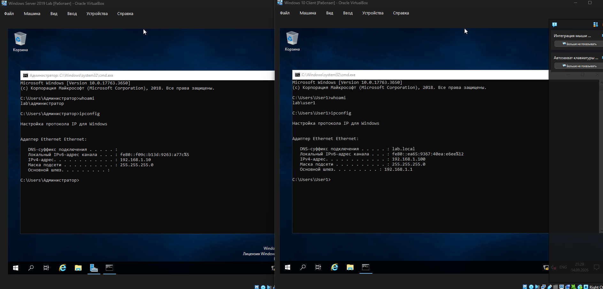

# 05. Подключение клиента к домену


## 🎯 Что делаем на этом этапе


\- Настраиваем DNS на клиенте (через DHCP — уже сделано на этапе 03).

\- Присоединяем клиентскую машину Windows 10 к домену `lab.local`.

\- Перезагружаем и входим под доменной учётной записью.

\- Проверяем результат через `ipconfig`, `whoami`, `echo %USERDOMAIN%`.


## 🧰 Что понадобится


\- Windows Server 2019 с настроенными AD DS, DNS, DHCP (этапы 02–04).

\- Клиентская машина Windows 10 в той же сети VirtualBox (`labnet`).

\- Учётная запись с правами на ввод в домен (по умолчанию — `Администратор домена`).

\- Доменная учётная запись для последующего входа (например, `user1`).


## 📝 Шаги


### 1. Проверка сети и DNS на клиенте


Перед вводом в домен убедиться:

\- клиент и сервер в одной сети VirtualBox (Internal Network `labnet`);

\- клиент получил IP от DHCP — `ipconfig` показывает адрес из диапазона `192.168.1.100–200`;

\- DNS-сервер клиента — `192.168.1.10` (получен через DHCP автоматически).


Проверить связь с сервером:


```cmd

ping 192.168.1.10

### 2. Присоединение к домену

Пуск → Параметры → Система → О системе.


Нажать «Переименовать этот ПК (дополнительно)».


Вкладка «Имя компьютера» → кнопка «Изменить».


Выбрать «Домен» и ввести: lab.local.


Нажать ОК.


Ввести учётные данные с правами на ввод в домен:


Имя пользователя: LAB\\Администратор (или lab.local\\Администратор).


Пароль администратора домена.


Появится сообщение «Добро пожаловать в домен lab.local» → ОК.


Перезагрузить клиент.


### 3. Вход под доменной учётной записью

На экране входа выбрать «Другой пользователь».


Ввести:


Имя пользователя: LAB\\user1 (или user1@lab.local).


Пароль user1.


Войти.


## 🧪 Проверка


На клиенте в командной строке:


cmd

ipconfig

echo %USERDOMAIN%

whoami

Ожидаемый результат:


Команда	Результат

ipconfig	IPv4-адрес из диапазона 192.168.1.100–200, шлюз 192.168.1.1, DNS-суффикс lab.local

echo %USERDOMAIN%	LAB

whoami	lab\\user1


## ⚠️ Проблемы и решения (из личного опыта)


Ошибка «Неверное имя пользователя или пароль» при вводе в домен.


Причина: в поле имени пользователя введено Administrator (без указания домена), а нужно LAB\\Администратор или lab.local\\Администратор.


Решение: указывать домен явно — префикс LAB\\ перед именем учётной записи. На русской версии Windows встроенная учётка называется Администратор, а не Administrator.


Клиент не видит контроллер домена.


Убедиться, что обе ВМ в одной сети VirtualBox (labnet, тип Internal Network).


Проверить, что DNS на клиенте указывает на 192.168.1.10 (а не на внешний DNS).


Проверить связь через ping 192.168.1.10.


Клиент получает адрес 169.254.x.x (APIPA).


DHCP не выдал адрес. См. раздел «Проблемы и решения» этапа 03.


При вводе в домен запрашивает пароль, а формат LAB\\Администратор не принимается.


Попробовать полный формат: lab.local\\Администратор.


Проверить раскладку клавиатуры — кириллица в имени учётки допустима только для встроенной учётки.


## 📸 Скриншот




