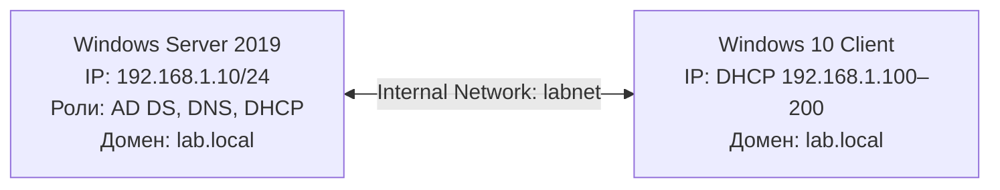

# Windows Server Active Directory Lab

## 📌 О проекте

Лабораторный стенд для практики администрирования **Windows Server 2019** и **Active Directory**.
Симулирует корпоративную сеть небольшой компании: контроллер домена, DNS, DHCP и клиентская машина Windows 10.

## 🎯 Цели проекта

- Развернуть контроллер домена с ролями **AD DS**, **DNS**, **DHCP**.
- Настроить автоматическую выдачу IP-адресов клиентам через DHCP.
- Создать пользователей и организационную структуру в Active Directory.
- Подключить клиентскую машину Windows 10 к домену.
- Отработать типовые задачи системного администратора уровня Junior.

## 🧰 Стек технологий

| Компонент | Версия / детали |
|-----------|-----------------|
| VirtualBox | 7.x |
| Windows Server | 2019 (Desktop Experience) |
| Windows Client | 10 |
| Роли | AD DS, DNS, DHCP |
| Инструменты | Server Manager, PowerShell, DHCP-оснастка |

## 🗺️ Архитектура стенда

## ✅ Что реализовано

- [x] Статический IP на сервере (192.168.1.10/24)
- [x] Установка ролей AD DS, DNS, DHCP
- [x] Создание нового леса `lab.local`
- [x] Создание пользователей: User1, User2, User3
- [x] Настройка DHCP-области (192.168.1.100–200)
- [x] Авторизация DHCP в Active Directory
- [x] Подключение клиента к домену и вход под доменной учётной записью

## 🚀 Пошаговая инструкция

Подробные шаги с пояснениями и скриншотами разбиты по этапам:

1. [Настройка сервера и статического IP](./01-Server-Setup/README.md)
2. [Active Directory (AD DS)](./02-AD-DS/README.md)
3. [DHCP](./03-DHCP/README.md)
4. [DNS](./04-DNS/README.md)
5. [Подключение клиента к домену](./05-Client-Join/README.md)

## 🧪 Проверка работоспособности

| Что проверяем | Команда | Ожидаемый результат |
|---------------|---------|---------------------|
| IP клиента | `ipconfig` | Адрес из диапазона 192.168.1.100–200 |
| Связь с сервером | `ping 192.168.1.10` | 0% потерь |
| Разрешение имён | `nslookup lab.local` | Отвечает 192.168.1.10 |
| Домен клиента | `echo %USERDOMAIN%` | LAB |
| Пользователь | `whoami` | lab\user1 |

## ⚠️ Проблемы и решения (из личного опыта)

- **APIPA у клиента (169.254.x.x)** — исправлено сменой типа сети в VirtualBox на «Внутренняя сеть» с именем `labnet`.
- **Ошибка «Install-ADDSForest не распознано»** — исправлено установкой роли через `Install-WindowsFeature -Name AD-Domain-Services -IncludeManagementTools` и перезапуском PowerShell.
- **Ошибка пароля при вводе в домен** — использован формат `LAB\Администратор`.
- **DHCP не выдаёт адреса** — проверить: активирована ли область, авторизован ли DHCP в AD, стоит ли клиент в одной Internal Network с сервером.
- **Ошибка при вводе в домен** — на клиенте DNS должен указывать на `192.168.1.10`, а не на внешний сервер.

## 📸 Скриншоты

Скриншоты по каждому этапу лежат в соответствующих папках:

| Этап | Скриншот |
|------|----------|
| 01. Server Setup | [01-server-manager.png](./01-Server-Setup/screenshots/01-server-manager.png) |
| 02. AD DS | [02-ad-users.png](./02-AD-DS/screenshots/02-ad-users.png) |
| 03. DHCP | [03-dhcp-scope.png](./03-DHCP/screenshots/03-dhcp-scope.png) |
| 04. DNS | [04-dns-zone.png](./04-DNS/screenshots/04-dns-zone.png) |
| 05. Client Join | [05-client-whoami-ipconfig.png](./05-Client-Join/screenshots/05-client-whoami-ipconfig.png) |

## 👤 Автор

Денис Жафёров — [GitHub](https://github.com/NascarTAT)

